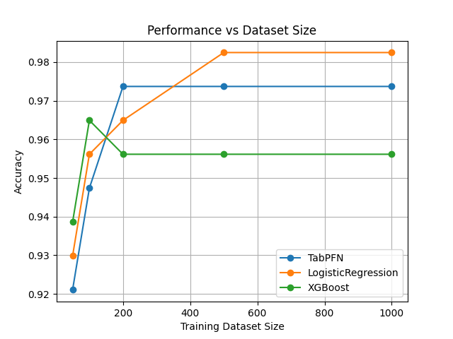
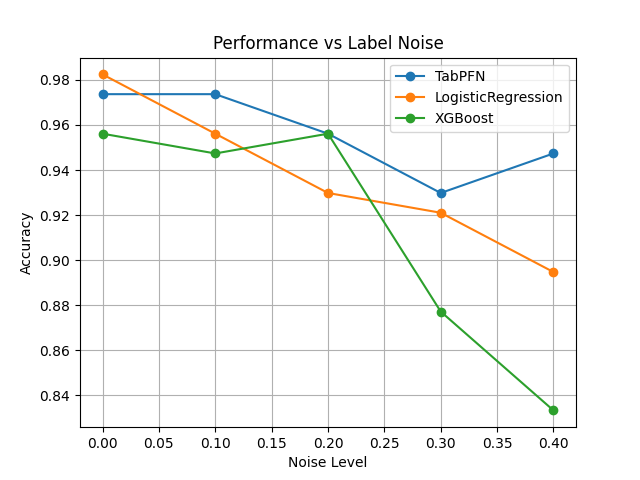

# When Does TabPFN Fail? – An Empirical Study

## Motivation

Tabular data remains one of the most widely used data modalities in real-world machine learning applications. Recently, TabPFN (Tabular Prior-Data Fitted Network) has emerged as a foundation model for tabular data, showing strong performance particularly in low-data regimes.

This project aims to empirically investigate the behavior of TabPFN and answer the following questions:

- When does TabPFN outperform traditional machine learning models?
- How does TabPFN behave under challenging conditions such as limited data and label noise?
- What are the limitations of TabPFN compared to established methods?

---

## Experiments

### 1. Small Data Regime

We evaluate model performance across varying training dataset sizes:

- Sample sizes: 50, 100, 200, 500, 1000
- Models compared:
  - TabPFN
  - XGBoost
  - Logistic Regression

The goal is to understand how models behave when training data is scarce.

---

### 2. Label Noise Robustness

We introduce synthetic label noise into the training data:

- Noise levels: 0%, 10%, 20%, 30%, 40%
- Models compared:
  - TabPFN
  - XGBoost
  - Logistic Regression

This experiment evaluates robustness to corrupted supervision, which is common in real-world datasets.

---

## Results

### Small Data Performance

### Noise Robustness

---

## Key Findings

- TabPFN performs strongly in low-data regimes, often outperforming traditional models when the number of training samples is limited.
- TabPFN demonstrates stable performance under increasing label noise, particularly in high-noise settings (30–40%).
- XGBoost shows significant degradation under high label noise, indicating sensitivity to corrupted labels.
- Logistic Regression degrades steadily as noise increases, highlighting the limitations of linear models under noisy supervision.
- In clean data settings, traditional models can be competitive or slightly outperform TabPFN.

---

## Conclusion

The results suggest that TabPFN provides a robust alternative to traditional tabular learning methods, particularly in challenging scenarios such as limited data availability and noisy labels. Its prior-based learning approach appears to contribute to improved generalization under such conditions.
